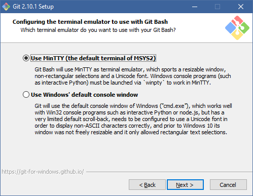
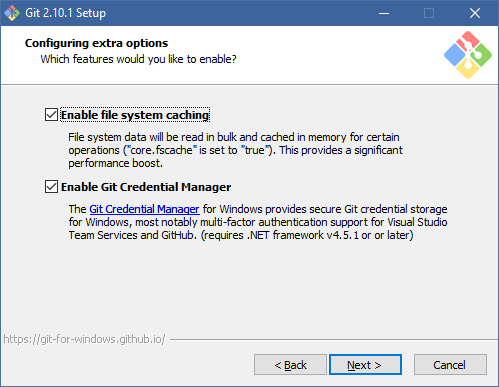

# Instalasi Git #

## Instalasi Git di Windows ##

Installer Git di Windows dibuatkan oleh MSysGit, yang bisa diunduh di
[websitenya](http://code.google.com/p/msysgit/). Unduhlah file yang nama
depannya Git, contohnya seperti ini: Git-2.10.1-64-bit.exe.
Ambil saja versi yang terbaru. Setelah diunduh, kita bisa langsung
jalankan. Berikut panduan screen demi screen.

Screen pertama adalah License. Langsung saja klik Next.

Pada bagian ini kita pilih komponen yang ingin diinstall. Anda dapat mengikuti seperti berikut ini lalu klik Next. 

Di screen berikutnya, kita perlu mengganti opsinya karena berbeda dengan
setting standar yang ditawarkan. Berikut posisi opsi yang seharusnya.

Configuring The Line Ending Conversions biarkan saja
seperti yang disarankan. Ini gunanya untuk mengatasi perbedaan karakter
ganti baris di Windows (CRLF) dan Linux (LF saja) Line Endings.

Selanjutnya pilih sesuai opsi yang disarankan.

Berikut juga opsi tambahan, pilih sesuai berikut.

Jika muncul seperti berikut, berarti perlu menutup aplikasi tersebut  yang ada dalam daftar terlebih dahulu sebelum install.

Setelah selesai, kita bisa test dengan membuka command prompt dan
mengetik perintah

`git`

Kalau instalasi berjalan lancar, maka akan muncul output dari git
sebagai berikut.

    usage: git [--version] [--exec-path[=<path>]] [--html-path]
               [-p|--paginate|--no-pager] [--no-replace-objects]
               [--bare] [--git-dir=<path>] [--work-tree=<path>]
               [-c name=value] [--help]
               <command> [<args>]
    
    The most commonly used git commands are:
       add        Add file contents to the index
       bisect     Find by binary search the change that introduced a bug
       branch     List, create, or delete branches
       checkout   Checkout a branch or paths to the working tree
       clone      Clone a repository into a new directory
       commit     Record changes to the repository
       diff       Show changes between commits, commit and working tree, etc
       fetch      Download objects and refs from another repository
       grep       Print lines matching a pattern
       init       Create an empty git repository or reinitialize an existing one
       log        Show commit logs
       merge      Join two or more development histories together
       mv         Move or rename a file, a directory, or a symlink
       pull       Fetch from and merge with another repository or a local branch
       push       Update remote refs along with associated objects
       rebase     Forward-port local commits to the updated upstream head
       reset      Reset current HEAD to the specified state
       rm         Remove files from the working tree and from the index
       show       Show various types of objects
       status     Show the working tree status
       tag        Create, list, delete or verify a tag object signed with GPG
    
    See 'git help <command>' for more information on a specific command.

## Instalasi Git di Ubuntu ##

Untuk instalasi di Ubuntu, kita perlu menginstal paket-paket berikut :

-   git-core
-   gitg

Kalau menggunakan command prompt, berikut perintahnya

`sudo apt-get install git-core gitg`

Setelah selesai, kita bisa test dengan membuka command prompt dan
mengetik perintah `git`. Kalau instalasi berjalan lancar, maka akan
muncul output dari git sebagai berikut.

    usage: git [--version] [--exec-path[=<path>]] [--html-path]
               [-p|--paginate|--no-pager] [--no-replace-objects]
               [--bare] [--git-dir=<path>] [--work-tree=<path>]
               [-c name=value] [--help]
               <command> [<args>]
    
    The most commonly used git commands are:
       add        Add file contents to the index
       bisect     Find by binary search the change that introduced a bug
       branch     List, create, or delete branches
       checkout   Checkout a branch or paths to the working tree
       clone      Clone a repository into a new directory
       commit     Record changes to the repository
       diff       Show changes between commits, commit and working tree, etc
       fetch      Download objects and refs from another repository
       grep       Print lines matching a pattern
       init       Create an empty git repository or reinitialize an existing one
       log        Show commit logs
       merge      Join two or more development histories together
       mv         Move or rename a file, a directory, or a symlink
       pull       Fetch from and merge with another repository or a local branch
       push       Update remote refs along with associated objects
       rebase     Forward-port local commits to the updated upstream head
       reset      Reset current HEAD to the specified state
       rm         Remove files from the working tree and from the index
       show       Show various types of objects
       status     Show the working tree status
       tag        Create, list, delete or verify a tag object signed with GPG
    
    See 'git help <command>' for more information on a specific command.

## Instalasi Git di Mac ##

TODO

## Instalasi Tortoise Git ##

Tortoise Git adalah antarmuka Git yang terintegrasi dengan Windows
Explorer. Dengan menggunakan TortoiseGit, kita bisa menggunakan fitur
Git dengan menggunakan klik kanan di Windows Explorer.

Install TortoiseGit bisa didapatkan di
[websitenya](http://code.google.com/p/tortoisegit/). Ambil saja versi
terbaru. Setelah itu, klik Next beberapa kali hingga selesai. Tidak ada
opsi yang diubah, ikuti saja setting yang dianjurkan.

Welcome Screen Pilihan SSH Client

Setelah selesai instalasi, kita bisa langsung menggunakan TortoiseGit.
Sebaiknya Windowsnya direstart dulu, kalau tidak biasanya ada masalah
dengan pewarnaan icon.

Buka Windows Explorer, di sana ada menu tambahan yang disediakan oleh
TortoiseGit, salah satunya adalah clone. Klik Kanan ada menu Clone Kalau
kita klik clone, kita akan dimintai alamat repository yang ingin kita
clone. Informasi Clone Pada waktu pertama kali terkoneksi dengan server
Git, biasanya kita akan ditanyai apakah kita ingin menyimpan SSH key
dari server tersebut. Save host key, pertama kali connect Setelah kita
lanjutkan dan tidak ada masalah dengan jaringan ataupun permission,
clone akan selesai dengan baik. Clone selesai Dengan demikian,
TortoiseGit telah terinstal dengan sukses. Untuk selanjutnya, operasi
Git akan dijelaskan melalui command line. Bila command line dipahami,
menggunakan TortoiseGit juga tidak akan sulit.

## Konfigurasi Awal ##

Konfigurasi utama yang harus kita lakukan adalah mendaftarkan nama dan
email kita. Nama dan email ini akan digunakan untuk mencatat siapa yang
membuat perubahan di repository.

Konfigurasi username dan email dilakukan melalui perintah `git config`
sebagai berikut:

`git config user.name "Endy Muhardin"`

`git config user.email endy.muhardin@gmail.com`

Hasilnya bisa kita lihat menggunakan perintah `git config --list`.
Berikut contohnya:

`git config --list`

    user.name=Endy Muhardin
    user.email=endy.muhardin@gmail.com

Selain username dan email, buat kita yang sering menggunakan
commandline, perlu juga untuk mengaktifkan pewarnaan.

`git config color.ui true`

Konfigurasi user dan email di atas hanya berlaku di satu repository
saja. Bila kita membuat repository lain, kita harus melakukan
konfigurasi tersebut lagi. Bila kita menggunakan komputer dengan
username pribadi (bukan komputer umum seperti di warnet atau di lab
komputer) kita tentu ingin sekali konfigurasi berlaku untuk semua
repository. Untuk itu, kita bisa menggunakan opsi `--global` seperti
contoh berikut :

`git config --global user.name "Endy Muhardin"`

Bagi pengguna TortoiseGit, konfigurasi dilakukan menggunakan klik kanan.
Settings Menu Setelah itu, pilih menu Config di tab kiri. Konfigurasi
username dan email Di sana juga disediakan tombol untuk memberlakukan
konfigurasi secara local atau global.

